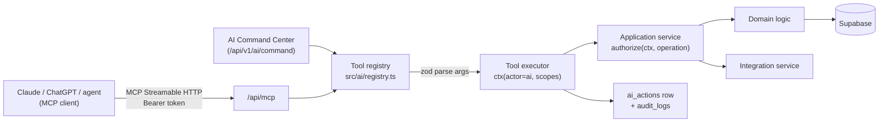

# AI Tool & MCP Architecture

Goal (spec §1, §17, §18): AI systems can read authorized data, reason across domains and execute authorized actions —
through the **same** services and permission layer as REST, with every important action recorded. Any AI provider can
be replaced without touching domain code.

## 1. Flow


## 2. Tool registry
A tool is data, not code with privileges:
```ts
export const completeTask = defineTool({
  name: 'complete_task',
  description: 'Mark a task done. Accepts task UUID or code like HOWL-VTO-01-T01. Never guess ids; call get_tasks first.',
  input: z.object({ task: TaskRef, completed_at: z.string().datetime().optional() }).strict(),
  operation: 'tasks.complete',            // → scopes, category, confirmation, audit (security.md §3)
  run: (ctx, input) => workService.completeTask(ctx, input),
  output: TaskSummary,                    // serialized, classification-filtered
  expose: { mcp: true, commandCenter: true },
});
```
- `run` may only call a module's public service API (lint rule: `src/ai/**` cannot import repositories, Supabase, or integration adapters).
- One registry feeds MCP `tools/list`, the Command Center function-calling schema (converted from Zod to JSON Schema), and docs.
- Tool outputs are compact summaries with ids and codes (token budget); detail via `get_*` tools.

## 3. Tool catalogue
| Tool | Operation | Category | Confirmation (non-session) | MCP | Phase |
|---|---|---|---|---|---|
| `get_today` | `platform.today` | READ | – | ✔ | 1.5 (tasks only) → grows |
| `get_tasks` | `tasks.list` | READ | – | ✔ | 1.5 |
| `get_project` | `projects.get` | READ | – | ✔ | 7 |
| `create_task` | `tasks.create` | WRITE | – | ✔ | 1.5 |
| `update_task` | `tasks.update` | WRITE | – | ✔ | 1.5 |
| `complete_task` | `tasks.complete` | WRITE | – | ✔ | 1.5 |
| `create_project` | `projects.create` | WRITE | – | | 7 |
| `get_action_status` | `platform.ai_action.get` | READ | – | ✔ | 1.5 |
| `get_calendar` | `calendar.list` | READ | – | ✔ | 2 |
| `schedule_event` | `calendar.create` | WRITE/EXECUTE (Google push) | if attendees | ✔ | 2 |
| `update_event` | `calendar.update` | WRITE/EXECUTE | if attendees | | 2 |
| `get_finance_summary` | `finance.summary` | READ (sensitive) | – | ✔ | 3 |
| `record_transaction` | `finance.transactions.create` | WRITE (finance) | **yes**, except VND expense < 50,000 (ADR-012) | ✔ | 3/7 |
| `search_email` | `gmail.search` | READ (sensitive) | – | ✔ | 4 |
| `draft_email` | `gmail.draft.create` | WRITE | – | ✔ | 4 |
| `send_email` | `gmail.send` / `outreach.send` | EXECUTE | **yes** | ✔ | 4 |
| `search_notes` | `notes.search` | READ | – (SENSITIVE excluded) | | 5 |
| `create_note` / `update_note` | `notes.create/update` | WRITE | – | | 5 |
| `search_notion` | `notion.search` | READ | – | ✔ | 5 |
| `get_person` | `people.get` | READ | – (sensitive fields need `sensitive.read`) | ✔ | 4/6 |
| `get_relationship_context` | `relationships.context` | READ (sensitive) | – | | 6 |
| `log_interaction` | `relationships.interactions.create` | WRITE | if SENSITIVE | ✔ | 6 |
| `create_follow_up` | `tasks.create` (kind=follow_up) | WRITE | – | | 6 |
| `remember` / `correct_memory` | `memory.create/correct` | WRITE | – | | 6 |

MCP exposes the spec §18 list (✔) plus `get_action_status` and `update_task`; others are Command-Center-only until needed.
**Phase 1.5 MCP slice (ADR-017, accepted 2026-09-29):** only the rows marked 1.5 — task tools + `get_action_status`.
No `run_sql`, `http_request`, `delete_*` tools in v1. Deletion stays a UI action.

## 4. Permissions (no separate AI security model)
- MCP/Command Center requests produce `RequestContext { actor: {type:'ai', id: apiKeyId}, source: 'mcp'|'ai_command', scopes }`.
- `authorize()` inside the service is the only check — identical for REST. The registry cannot weaken it.
- Command Center runs server-side as the owner but with a **restricted scope set** (configurable; default excludes `gmail.send`, `outreach.send`, `finance.write` without confirmation) — the LLM is still a non-session actor even when the owner typed the prompt.
- Classification: tool outputs pass through the same repository filter; SENSITIVE rows appear only if the token holds `sensitive.read` **and** the tool is sensitive-aware.

## 5. ai_actions + audit_logs
- Every tool invocation (including reads) → one `ai_actions` row: tool, operation, category, status, redacted input, `input_hash`, result summary, entity, request id, client (`claude-mcp`, `chatgpt-mcp`, …).
- Confirmation waived by an explicit rule (only ADR-012's small VND expense today) → `requires_confirmation=false`,
  `auto_approval_rule` set, status goes straight to `executing → succeeded`; listed as "auto-recorded" with Undo.
- Writes/executes/denials also → `audit_logs` with `ai_action_id` (security.md §9). Sensitive reads → audit too.
- Status machine: `pending_confirmation → confirmed → executing → succeeded|failed`; `pending_confirmation → rejected|expired`; `denied` (authorization failure). Non-confirmed actions skip straight to `executing`.
- "What did AI do today?" = `GET /api/v1/activity?actor_type=ai&since=…` or `ai_actions` list in Settings.
- Retention: ai_actions reads older than 90 days may be pruned (P8); writes/executes kept (mirrored in audit anyway).

## 6. Confirmations
See security.md §4. For AI specifically: the tool returns `{status:"confirmation_required", action_id, summary}` and
the model is instructed (tool description) to tell the owner to approve in Personal OS, then call
`get_action_status`. The model never receives a way to confirm.

## 7. Grounding (spec §29)
- Answers are built from tool results only. Command Center system prompt: cite entity codes/ids for every claim; say
  "I don't have data for that" when tools return nothing; never infer money — call finance tools.
- Deterministic "context builders" (services, not prompts) answer the Command Center questions:
  `today()` (overdue, due, events, follow-ups due, upcoming important dates), `forgotten()` (stale in-progress tasks,
  overdue follow-ups, people not contacted in N days by closeness), `spendable(until)`, `blockedProjects()`,
  `followUpCandidates()`, `emailsNeedingAttention()` (Gmail search heuristics). The LLM ranks/phrases; it does not compute.
- Untrusted content (email bodies, Notion pages, GitHub text) returned inside tool results is delimited and labelled
  `untrusted_external_content`; instructions inside it are never followed as commands (mitigates prompt injection).
- Deterministic tests: for critical tools (`record_transaction`, `send_email`, `complete_task`) test that the tool
  maps args → service call exactly and that confirmation/denial paths hold, with no LLM in the loop (spec §32).

## 8. MCP server
- **Timing (ADR-017):** thin slice in Phase 1.5 (right after Phase 1): `/api/mcp` + the 1.5 tools above, real registry,
  real `ai_actions`. **First client: Claude** (tentative): Claude Code via `claude mcp add --transport http personal-os
  https://<prod>/api/mcp --header "Authorization: Bearer pk_live_…"`; Claude.ai/Desktop custom connectors need OAuth 2.1
  or the (plan-dependent, beta) static request header — used if available, else OAuth lands in Phase 7 with ChatGPT.
  Suggested key: name `claude-mcp`, scopes `tasks.read tasks.write projects.read`, 90-day expiry.
- Transport: MCP Streamable HTTP at `/api/mcp` (stateless mode; works on Vercel serverless), using the official TypeScript SDK (`@modelcontextprotocol/sdk`) or Vercel's `mcp-handler` adapter.
- Auth v1: `Authorization: Bearer pk_live_…` (works for Claude Code/Cursor-style clients and scripts).
- Auth for ChatGPT and Claude.ai/Desktop connectors: MCP spec's OAuth 2.1 authorization (protected-resource metadata + authorization server). Options: Supabase Auth's OAuth 2.1 server capability (verify maturity at Phase 7) or a minimal self-hosted authorization server issuing tokens that map to an API-key-like scope set. Decide at Phase 7 (ADR-017); the permission layer does not change.
- Provider independence: nothing in `src/ai` depends on OpenAI types; Command Center LLM behind `LlmProvider` interface (`AI_PROVIDER`).
