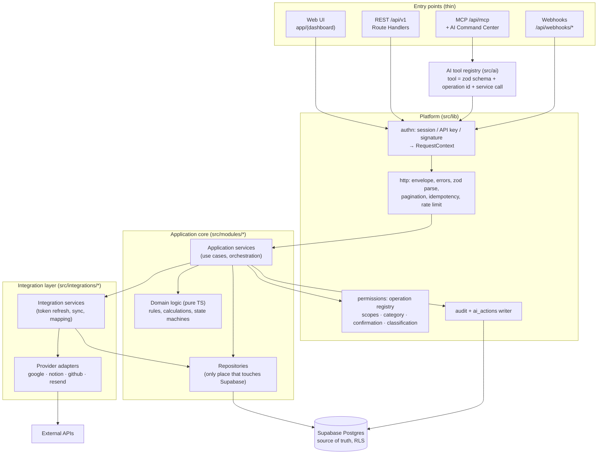

# Architecture

Status: **Phase 0 proposal**. Nothing here is implemented. Decisions marked ADR-xxx live in [decisions.md](decisions.md).

## 1. Shape of the system

One Next.js application (App Router) deployed on Vercel, one Supabase project (Postgres + Auth) per environment.
Modular monolith: domain modules with enforced boundaries inside one deployable. No queues, workers, Redis, Edge
Functions or microservices until a concrete requirement appears (spec §3).

Three front doors, **one** application core:

| Entry | Who | Auth | Path |
|---|---|---|---|
| Web UI | Founder in browser | Supabase session cookie | `app/(dashboard)` → Server Actions/Route Handlers |
| REST `/api/v1` | Scripts, future consumers | Session **or** `Bearer pk_live_…` API key | `app/api/v1/**/route.ts` |
| MCP `/api/mcp` | Cursor (P1.5a), ChatGPT (P1.5b), Claude/agents later | API key (Cursor) or Supabase-issued OAuth 2.1 token (ChatGPT), same endpoint (ADR-017) | `app/api/mcp/route.ts`, `app/.well-known/oauth-protected-resource/route.ts`, `app/oauth/consent/page.tsx` |
| Webhooks `/api/webhooks/*` | Google, Resend, GitHub | Provider signature | `app/api/webhooks/<provider>/route.ts` |

All four build the same `RequestContext` and call the same application services. Permission checks happen inside the
service entry point via the operation registry, so no entry can skip them.

## 2. Layer diagram



Rules (lint-enforced where possible):
1. Route handlers / MCP tools / Server Actions contain no business logic: parse → `service.op(ctx, input)` → envelope.
2. Domain logic is pure (no I/O) and is where finance math, task state transitions, code rules and classification rules live. 100% unit-testable.
3. Only repositories import the Supabase client. Only `src/integrations/*` import provider SDKs / call provider URLs.
4. UI components never call Supabase or third parties (spec §33). Client components receive data from Server Components or call `/api/v1`.
5. AI never gets SQL. Tools map 1:1 to service operations (spec §4, §17).

## 3. Repository layout (final proposal)

```
personal-os/
├─ src/
│  ├─ app/
│  │  ├─ (auth)/login/                     # magic link / OTP, owner allowlist
│  │  ├─ (dashboard)/                      # /, /projects, /tasks, /finance, /calendar, /relationships, /settings
│  │  ├─ api/v1/<resource>/route.ts        # REST, thin
│  │  ├─ api/mcp/route.ts                  # MCP Streamable HTTP, stateless (Phase 1.5a Cursor / 1.5b ChatGPT)
│  │  ├─ .well-known/oauth-protected-resource/route.ts  # RFC 9728 metadata (Phase 1.5b)
│  │  ├─ oauth/consent/page.tsx           # Supabase OAuth 2.1 server consent UI (Phase 1.5b)
│  │  └─ api/webhooks/<provider>/route.ts  # Phase 2+/8
│  ├─ modules/                             # one folder per bounded context
│  │  ├─ work/        (projects, tasks, dependencies, companies)
│  │  ├─ time/        (calendar events, time blocks)
│  │  ├─ finance/     (accounts, transactions, debts, goals)
│  │  ├─ people/      (people, relationships, interactions, important dates)
│  │  ├─ outreach/    (leads, campaigns, sequences, email messages/events)
│  │  ├─ knowledge/   (notes)
│  │  ├─ memory/      (memories)
│  │  ├─ timeline/    (read-only, over timeline_events view)
│  │  └─ platform/    (profile, api keys, audit read, ai_actions/approvals)
│  │     each module:  index.ts (public API) · service.ts · domain.ts · repository.ts
│  │                   · schemas.ts (zod) · operations.ts (permission registry entries) · *.test.ts
│  ├─ integrations/
│  │  ├─ core/        (token vault crypto, oauth helpers, retry/backoff, provider catalog)
│  │  ├─ google/      (oauth.ts, calendar.adapter.ts, gmail.adapter.ts, mappers.ts)
│  │  ├─ notion/ · github/ · resend/
│  ├─ ai/
│  │  ├─ registry.ts  (tool definitions → operation ids)
│  │  ├─ tools/<module>.tools.ts
│  │  └─ mcp/server.ts
│  ├─ lib/            (supabase clients, auth, permissions, http envelope, errors, logging, crypto, env)
│  └─ components/     (shadcn/ui + dashboard widgets; no data access)
├─ supabase/
│  ├─ migrations/     (SQL-first, timestamped; 0000_proposed_schema.sql is a PROPOSAL)
│  ├─ seed.sql
│  └─ tests/          (SQL/RLS tests)
├─ tests/             (integration + API tests against local Supabase)
├─ docs/
├─ scripts/
├─ .env.example
└─ README.md
```

**I disagree with the spec's layer-first layout** (`services/*.service.ts`, `repositories/`, `types/` at root) **because**
it scatters one domain over five folders and gives no place to enforce boundaries. Vertical modules keep a domain's
schema, rules, repo and permission entries together, and let us enforce "modules import each other only via
`index.ts`" with `eslint-plugin-boundaries` (or `no-restricted-imports`). Trade-off: one extra level of nesting; the
spec's layers still exist, just inside each module.

Other refinements:
- `src/` root: keeps config files separate from code. Cosmetic, standard in Next.js.
- **Dropped `supabase/functions`** (Edge Functions): all server code runs in Next.js; a second runtime adds deploy and
  secret surfaces with no current requirement.
- **`lib/integrations` → `src/integrations`**: integrations are a layer, not a utility.
- **`lib/ai/permissions` removed**: there is exactly one permission layer (`src/lib/permissions`), shared by UI/REST/MCP (spec §18).
- Communication module named `outreach` for Resend/campaigns; Gmail mailbox access is an integration (`gmail.*` scopes), not a domain table (see schema.md).

## 4. Modular monolith boundaries

| Module | Owns tables | May read (via other module's `index.ts`) | Phase |
|---|---|---|---|
| platform | profiles, api_keys, ai_actions, audit_logs, idempotency_keys | — | 1 |
| work | companies, projects, tasks, task_dependencies | people (ids only) | 1 |
| time | calendar_events | work | 2 |
| finance | finance_accounts, finance_transactions, debts, financial_goals | people | 3 |
| outreach | leads, email_campaigns, email_sequence_steps, campaign_enrollments, email_messages, email_events | people | 4 |
| knowledge | notes | work, people | 5 |
| people | people, relationships, interactions, important_dates | time, outreach | 4 (people) / 6 (rest) |
| memory | memories | people | 6 |
| timeline | — (view `timeline_events`) | all, read-only | 6 |
| integrations | integration_accounts, integration_secrets, external_references, webhook_deliveries | called by modules | 2 |

Rules: a module writes only its own tables. Cross-module writes go through the owning service (e.g. `time` asks `work`
to link a task). Cross-module *reads* for dashboards/AI context go through each module's query functions, composed in
a `today`/`context` read service in `platform` — never ad-hoc joins across modules in route handlers. Postgres views
that span modules (timeline) are owned by one module and read-only.

## 5. Request lifecycle (write)

1. Entry authenticates → `RequestContext { userId, actor: {type, id}, source, scopes, requestId, confirmed? }`.
   Session actor = all scopes; API key/AI actor = key scopes.
2. Zod parses input (never trust client or AI args, spec §20). IDs accept UUID or human code.
3. `service.op(ctx, input)` → `authorize(ctx, 'tasks.complete', resource)`: scope check, category, classification,
   confirmation rule (see security.md). Denied → audit `denied`, 403.
4. Domain logic validates the transition; repository writes (RLS or explicit `user_id` filter).
5. Audit row written (sensitive/write/execute ops). Response envelope.

Transactions: supabase-js has no multi-statement transactions, so atomic multi-row writes are Postgres functions
called via RPC (e.g. `record_transfer`), and per-row invariants live in constraints/triggers (task codes, cycles).
Audit write is a separate statement after the mutation; if it fails we log an error with request id (accepted risk,
see risks.md R-07).

## 6. Environments

| Env | Supabase | Vercel | Credentials |
|---|---|---|---|
| local | `supabase start` (Docker) | `next dev` | dev OAuth clients, Resend test key |
| preview | shared *staging* project | preview deployments | staging credentials only |
| production | prod project | production | prod credentials, never copied to other envs |

Separate Google OAuth clients, Notion integrations, GitHub apps/PATs, Resend keys and `TOKEN_ENCRYPTION_KEY` per
environment (spec §20).

## 7. Environment variables

Full list with comments in [`.env.example`](../.env.example). Rules:
- Validated at boot with Zod in `src/lib/env.ts`; the app refuses to start on missing/invalid values.
- Only `NEXT_PUBLIC_*` may reach the browser; `src/lib/env.ts` exports a separate `clientEnv`. A lint rule forbids importing server env in client components (`import 'server-only'`).
- Secrets live in Vercel env (prod/preview separated) and local `.env.local` (git-ignored). Never in the DB except encrypted integration tokens.

| Variable | Scope | Required from | Purpose |
|---|---|---|---|
| `APP_ENV` | server | P1 | `local` \| `preview` \| `production`; gates dangerous features |
| `APP_URL` | server | P1 | Canonical origin for OAuth redirects, links |
| `NEXT_PUBLIC_SUPABASE_URL` | public | P1 | Supabase project URL |
| `NEXT_PUBLIC_SUPABASE_PUBLISHABLE_KEY` | public | P1 | Publishable (anon) key; RLS-restricted |
| `SUPABASE_SECRET_KEY` | server | P1 | Secret (service-role) key; used only by repositories for non-session actors |
| `OWNER_EMAIL` | server | P1 | Only email allowed to sign in (sign-ups disabled in Supabase too) |
| `API_KEY_PREFIX_ENV` | server | P1 | `live` or `test`; embedded in generated keys |
| `LOG_LEVEL` | server | P1 | `debug`…`error` |
| `SENTRY_DSN` / `NEXT_PUBLIC_SENTRY_DSN` | server/public | P1 | Error tracking (optional locally) |
| `TOKEN_ENCRYPTION_KEY` | server | P2 | 32-byte base64 AES-256-GCM key for integration tokens |
| `TOKEN_ENCRYPTION_KEY_VERSION` | server | P2 | Integer, stored with each ciphertext; enables rotation |
| `TOKEN_ENCRYPTION_KEY_PREVIOUS` | server | P2 | Optional old key during rotation |
| `GOOGLE_CLIENT_ID` / `GOOGLE_CLIENT_SECRET` | server | P2 | Google OAuth (Calendar, later Gmail). External app in Testing mode, separate GCP project per env (ADR-013) |
| `GOOGLE_OAUTH_REDIRECT_URI` | server | P2 | `${APP_URL}/api/v1/integrations/google/callback` |
| `GOOGLE_WEBHOOK_TOKEN` | server | P8 | Shared token for Calendar push channel verification |
| `RESEND_API_KEY` | server | P4 | Resend sending key (per env) |
| `RESEND_WEBHOOK_SECRET` | server | P4 | Svix signing secret for Resend webhooks |
| `NOTION_CLIENT_ID` / `NOTION_CLIENT_SECRET` | server | P5 | Notion public-integration OAuth (or internal token stored encrypted, ADR-013) |
| `GITHUB_TOKEN_MODE` | server | P5 | `pat` (v1) \| `app` |
| `GITHUB_APP_ID` / `GITHUB_APP_PRIVATE_KEY` / `GITHUB_WEBHOOK_SECRET` | server | P8 | Only if GitHub App chosen |
| `AI_PROVIDER` / `AI_API_KEY` / `AI_MODEL` | server | P7 | Command Center LLM; provider-agnostic |
| `MCP_OAUTH_ISSUER` | server | P1.5b | Supabase Auth issuer (`${NEXT_PUBLIC_SUPABASE_URL}/auth/v1`) accepted for MCP OAuth tokens; empty = MCP OAuth disabled (API keys only) |
| `CRON_SECRET` | server | P8 | Vercel Cron auth |
