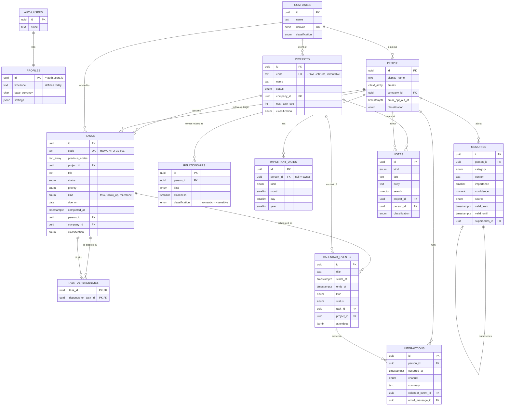
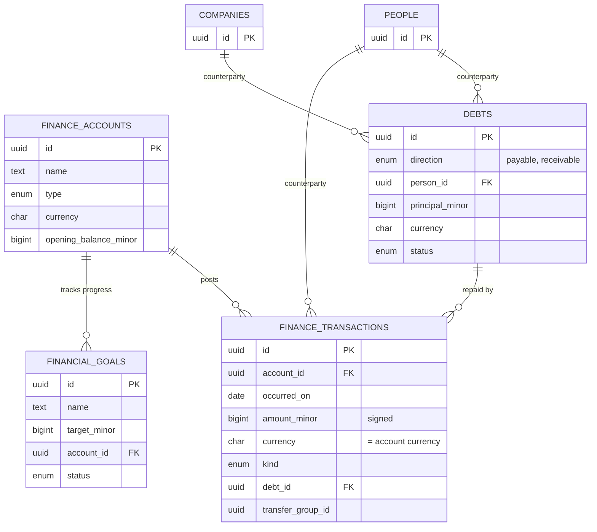
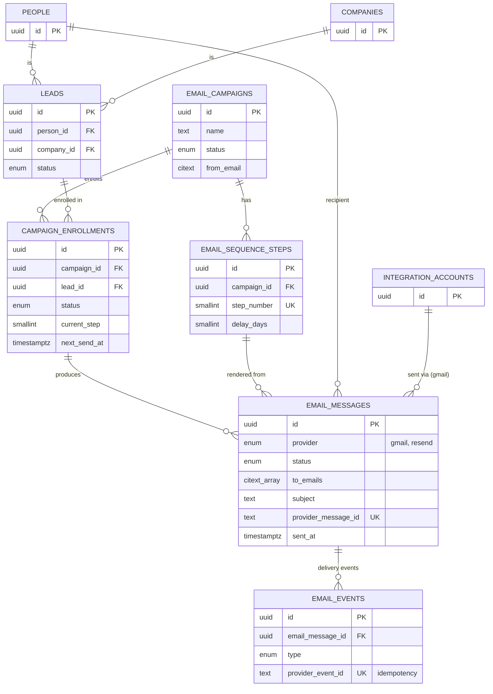
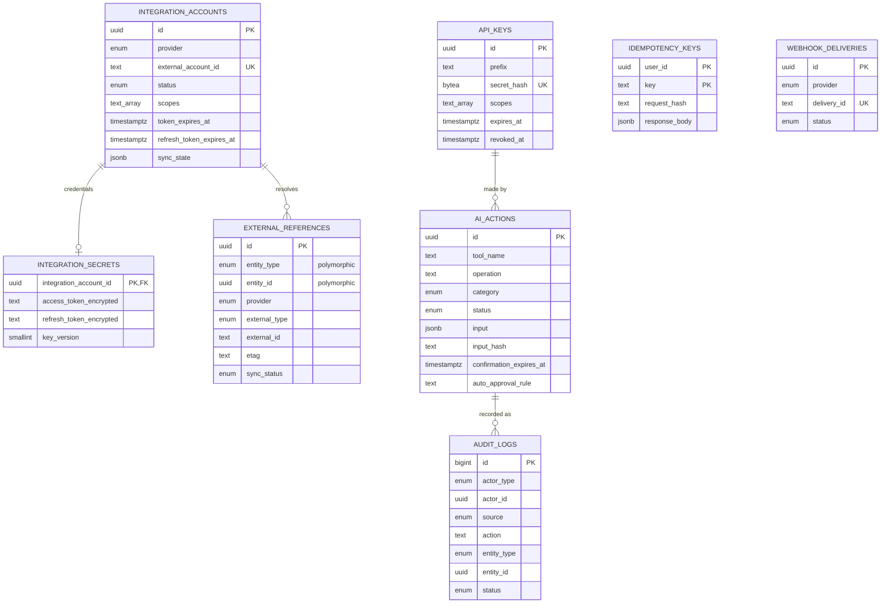

# ERD — Personal OS (proposed)

Source of truth for columns/constraints: `supabase/migrations/0000_proposed_schema.sql`. This diagram shows keys and the
attributes that matter for reasoning. Every table also has `user_id -> auth.users` (omitted from edges for readability),
`created_at`, `updated_at`; most have `archived_at` / `deleted_at`.

Validated with `@mermaid-js/mermaid-cli` (`mmdc`), see `scripts/validate-mermaid.sh`.

## Core, Work, Time, Knowledge, Relationships

## Finance

Derived (views, not tables): `finance_account_balances`, `debt_balances`.

## Communication (Phase 4)

## Integrations & Platform

