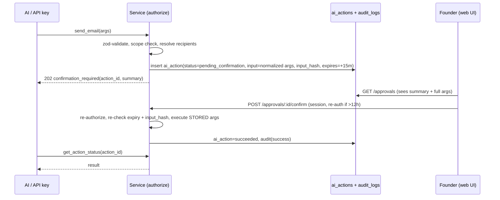

# Security & Permission Model

Threat model in one line: one owner, high-value personal data (finance, relationships, mail), and non-human actors
(AI, scripts) that can be wrong or manipulated (prompt injection via email/Notion content). Primary controls: strong
owner auth, least-privilege scopes, server-side confirmation for sensitive operations, append-only audit, secrets
never in the browser or logs.

## 1. Actors
| Actor | Authenticated by | Scopes | Can confirm? |
|---|---|---|---|
| `user` (Founder, web) | Supabase Auth session (email OTP/magic link, `OWNER_EMAIL` allowlist, sign-ups disabled) + optional TOTP MFA (recommended) | all | yes |
| `api_key` (scripts, Ivan's tools) | `Bearer pk_live_…` | key scopes | no → 202 pending |
| `ai` (MCP client, Command Center) | API key / OAuth token bound to MCP | token scopes ∩ tool | no → 202 pending |
| `integration` / `system` | webhook signature / cron secret | fixed internal operations | n/a |

"Ivan" as a separate human user is out of scope for v1 (single owner). Ivan's automation uses an API key named e.g. `ivan-cli`; audit
shows `actor_type=api_key, actor_id=<key id>` so "what did Ivan do today" is answerable per key. Multi-user = later ADR.

## 2. Scopes (spec §19, extended)
| Scope | Category | Sensitive (needs explicit approval at key creation) |
|---|---|---|
| `projects.read` / `projects.write` | READ / WRITE, DELETE | no |
| `tasks.read` / `tasks.write` | READ / WRITE, DELETE | no |
| `calendar.read` / `calendar.write` | READ / WRITE, DELETE, EXECUTE (push to Google) | no |
| `finance.read` / `finance.write` | READ / WRITE, DELETE | **yes** |
| `people.read` / `people.write` | READ / WRITE, DELETE | no |
| `relationships.read` / `relationships.write` | READ / WRITE, DELETE | **yes** |
| `memory.read` / `memory.write` | READ / WRITE, DELETE | **yes** |
| `notes.read` / `notes.write` | READ / WRITE, DELETE | no |
| `gmail.read` | READ (live mailbox) | **yes** |
| `gmail.draft` | WRITE (draft in Gmail) | no |
| `gmail.send` | EXECUTE | **yes** |
| `outreach.read` / `outreach.write` | READ / WRITE (leads, campaigns) | no |
| `outreach.send` | EXECUTE (Resend) | **yes** |
| `notion.read` / `notion.write` | READ / EXECUTE (external write) | no |
| `github.read` | READ | no |
| `sensitive.read` | modifier: allows rows classified SENSITIVE | **yes** |
| `audit.read` | READ | no |
| `ai.command` | use AI Command Center (Phase 7) | no |
| `integrations.manage` | connect/disconnect | **session only** |
| `api_keys.manage` | | **session only** (never grantable to a key) |

Wildcards are not supported (explicit lists only). Scope strings are validated against a TS const union.

## 3. Operation registry (the single permission layer)
Every service operation is declared once:
```ts
defineOperation({
  id: 'gmail.send',              // also the audit `action`
  category: 'EXECUTE',           // READ | WRITE | DELETE | EXECUTE
  scopes: ['gmail.send'],        // all required
  confirmation: 'non_session',   // 'never' | 'non_session' | 'always'
  audit: 'always',               // 'always' | 'writes' | 'sensitive_reads'
  classificationAware: true,
  summarize: (input) => `Send email to ${input.to.join(', ')}: "${input.subject}"`,
});
```
`authorize(ctx, opId, resource?)` is called first thing inside the service method, so REST, Server Actions, MCP tools
and Command Center are covered identically (spec §18). Unit tests assert every exported service method has an operation.

### Category defaults
| Category | Examples | Default confirmation | Audit |
|---|---|---|---|
| READ | list tasks, finance summary | never | only sensitive reads by non-session actors (finance, SENSITIVE rows, Gmail content) |
| WRITE | create/update task, log interaction | never (except finance & SENSITIVE rows by non-session → `non_session`; small-expense exception below) | always |
| DELETE | soft delete anything, external delete (Google event) | `non_session`; UI shows dialog for session | always |
| EXECUTE | send email (Gmail/Resend), push/cancel calendar event with attendees, Notion write | `non_session`; `always` for sending to >1 recipient or enrolling leads in a campaign | always |

Spec §19 confirmation list mapped: send email → EXECUTE; delete data → DELETE; financial actions → finance WRITE/DELETE;
sensitive relationship data → SENSITIVE rows; external destructive → DELETE/EXECUTE.

### Small-expense exception (ADR-012, accepted 2026-09-29)
`finance.transactions.create` by a non-session actor skips confirmation **only** for a plain VND expense with
`abs(amount_minor) < 50000` (strictly below 50,000 VND; 50,000 itself is gated), into an existing non-archived account,
no transfer/debt link/income, with an `Idempotency-Key`. Other currencies, income, transfers, debt-linked rows and
every update/delete stay gated. Expressed in the registry as a pure predicate:
```ts
defineOperation({
  id: 'finance.transactions.create', category: 'WRITE', scopes: ['finance.write'],
  confirmation: { mode: 'non_session_unless', rule: 'finance.small_expense_vnd_lt_50000',
                  when: (i) => i.kind === 'expense' && !i.debt_id && !i.transfer_group_id
                               && i.currency === 'VND' && -i.amount_minor < AI_EXPENSE_AUTO_RECORD_LIMIT.VND },
  audit: 'always', classificationAware: true,
});
```
A waived action is still an `ai_actions` row (`auto_approval_rule` set) plus an `audit_logs` row, appears in Activity as
"auto-recorded", and can be undone by the owner in one click (session soft delete, audited). Boundary tests: 49,999 VND
passes; 50,000 VND, 49,999 USD-minor, income, transfer, update, delete → 202. The threshold is a code constant
(`src/modules/finance/domain.ts`), not env/DB. Open question: rolling 24 h cap on waived totals (decisions.md ADR-012).

## 4. Confirmation flow

Properties: the agent cannot alter args after proposing (hash); the agent cannot confirm (confirm endpoint is
session-only); expiry 15 min; each confirmation executes once (status transition `pending_confirmation → confirmed →
executing` in one conditional UPDATE). MCP-client-side confirmation prompts (e.g. ChatGPT "allow this action?") are
**UX only, not a control**.

Session actor: the UI shows a confirm dialog and sends `X-Confirm: true`; without it, confirmation-required operations
return HTTP 428 `confirmation_required` (anti-accident, not anti-attacker — the session *is* the owner).

## 5. Authentication details
- Supabase Auth, email OTP; sign-ups disabled; server additionally rejects any user whose email ≠ `OWNER_EMAIL`.
  Enable TOTP MFA and require AAL2 for session-only endpoints (`/api-keys`, `/integrations`, `/approvals`) — recommended.
- `@supabase/ssr` cookies (HttpOnly, Secure, SameSite=Lax). Middleware refreshes sessions. `getUser()` (server-verified), never trust `getSession()` alone.
- Mutation via cookie auth requires `Origin` check (CSRF).

## 6. API keys (spec §21)
- Format: `pk_{live|test}_` + 43-char base64url of 32 random bytes (`crypto.randomBytes`, 256 bits) → shown once.
- Stored: `prefix` (first 12 chars, for display) + `secret_hash = sha256(full key)`. A slow hash (bcrypt/argon2) is unnecessary for 256-bit random secrets and would add latency to every request; lookup is by unique hash index.
- Checks per request: hash lookup → `revoked_at IS NULL` → `expires_at > now()` → scopes. `last_used_at` updated at most once/minute.
- Default expiry 90 days, max 365. Rotate = new key + 24 h overlap. Revoke = immediate.
- Sensitive scopes require re-auth within 5 min at creation (`sensitive_scopes_approved_at`).
- Keys never grant `api_keys.manage` / `integrations.manage`. `test` keys rejected in production.
- Secret scanning: `pk_live_` prefix registered with GitHub secret scanning custom pattern (repo setting).

## 7. RLS & data access
See schema.md §RLS. Summary: RLS on every table; owner-only policies; secrets tables service-role only; audit append-only
for all roles. Session requests use the user-JWT Supabase client (RLS enforced). Non-session actors use the secret-key
client inside repositories that always filter by `ctx.userId` — enforced by a repository base helper and an
integration test that runs every repository against a second user and expects zero rows. The secret key is imported
in exactly one file (`src/lib/supabase/admin.ts`, `server-only`).

## 8. Integration token storage
- OAuth access/refresh tokens → `integration_secrets`, encrypted with AES-256-GCM in the app (`TOKEN_ENCRYPTION_KEY`,
  random 96-bit IV per value, `key_version` column). The DB never sees plaintext; a DB dump alone is useless.
- Decrypt only inside `src/integrations/core/vault.ts`, only server-side, only at call time; never returned by any API.
- Rotation: deploy new key as current + old as `TOKEN_ENCRYPTION_KEY_PREVIOUS`, re-encrypt job, remove old.
- Refresh failure (`invalid_grant`) → account `status=expired`, integration health shows reconnect; no retry storm.
- Google (personal @gmail.com, OAuth app External + **Testing**, ADR-013): refresh tokens die 7 days after consent.
  `integration_accounts.refresh_token_expires_at` is set at consent; banner from T-48 h; Phase 8 cron reminder at T-24 h.
  Reconnect revokes the previous token. The app is not published, so no Google verification/CASA applies.

## 9. Audit (spec §22)
`audit_logs` row fields: actor_type, actor_id, source, action (= operation id), category, entity_type, entity_id,
status (success/failure/denied/pending), redacted input, result summary, error_code, request_id, ai_action_id, ip, user_agent.
- Written for: all WRITE/DELETE/EXECUTE, all denials, sensitive READs by non-session actors, auth events (key created/revoked, integration connected).
- Redaction: allow-list per operation (`auditFields`), plus global deny of keys matching `/token|secret|password|authorization|cookie|body_html|body_text/i`. Email bodies are not stored in audit — only subject + recipients + message id.
- Append-only (trigger for all roles). No retention limit (volume is small).

## 10. Rate limiting
- Vercel Firewall rate-limit rules (no Redis): `/api/v1/*` per IP 300/min, `/api/v1/health` & auth callbacks 30/min, `/api/webhooks/*` 600/min.
- Per API key: 120 req/min + 20 EXECUTE/hour, enforced in Postgres (`rate_limit_hit()` function on an UNLOGGED counter table) if Firewall per-header rules are insufficient — added in Phase 1 only if needed (ADR-018).
- Outbound: per-provider limiters in adapters (Gmail send quotas, Resend 2 req/s default) with backoff on 429.

## 11. Secrets & environments
- Server-only env vars; `import 'server-only'` in every module that reads them; no secret in `NEXT_PUBLIC_*`.
- Separate credentials per environment; preview deployments use staging Supabase + test OAuth clients; production keys only in Vercel Production env.
- Logs: pino JSON with redaction paths (`req.headers.authorization`, `cookie`, `*.token`, `*.secret`); Sentry `beforeSend` scrubs same.
- Dependencies: Renovate/Dependabot, `npm audit` in CI, lockfile committed.

## 12. AI-specific controls
- Tools are allow-listed, typed, and call services (no SQL, no HTTP passthrough).
- Content from email/Notion/GitHub/web is wrapped as untrusted data in tool results; tool results never grant permissions.
- No autonomous chains of EXECUTE actions: each EXECUTE needs its own confirmation.
- Classification filter applied before data leaves the service layer toward an LLM provider; SENSITIVE requires `sensitive.read` on the token.
- AI never computes money: finance tools return server-computed numbers.
